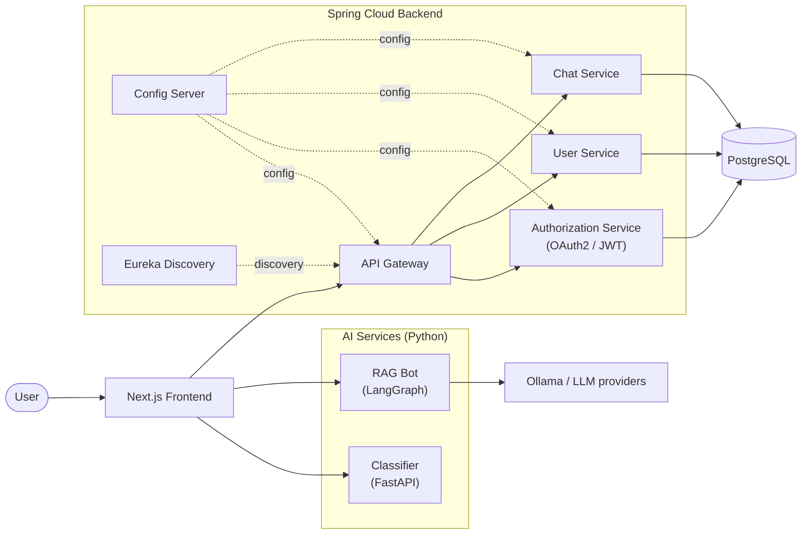
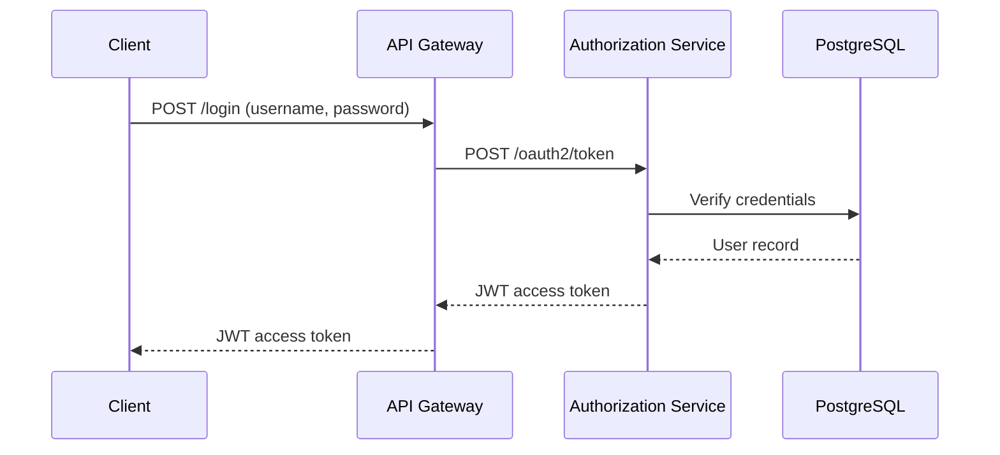
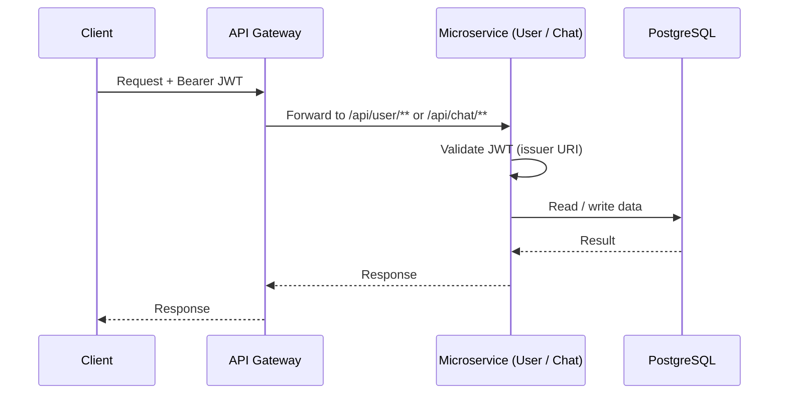
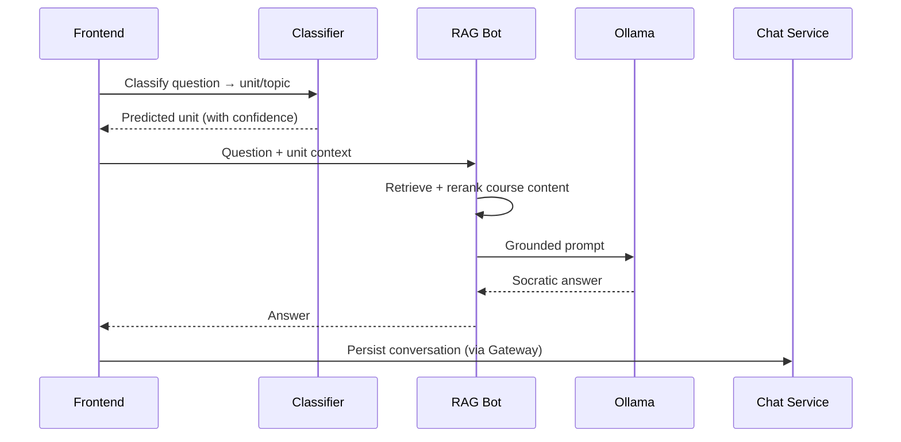

# Chatbot Microservice Platform

> An AI-powered learning assistant for IT students that combines a secure Spring Cloud microservices backend, a Next.js frontend, and Python AI services for course-grounded, Socratic tutoring.

<p align="left">
  
  
  
  
  
  
  
  
</p>

---

## Table of Contents

- [Overview](#overview)
- [Features](#features)
- [Architecture](#architecture)
- [Tech Stack](#tech-stack)
- [Prerequisites](#prerequisites)
- [Getting Started](#getting-started)
- [Configuration](#configuration)
- [Services & Ports](#services--ports)
- [Request Flow](#request-flow)
- [Project Structure](#project-structure)
- [Local Development](#local-development)
- [Troubleshooting](#troubleshooting)
- [Roadmap](#roadmap)
- [Acknowledgements](#acknowledgements)
- [License](#license)

---

## Overview

This platform helps IT students get accurate, course-specific help outside class hours. Instead of a generic chatbot that hallucinates or simply hands over answers, the system:

1. **Classifies** each question to the correct academic unit (topic).
2. **Retrieves** relevant content from real course materials via a Retrieval-Augmented Generation (RAG) pipeline.
3. **Responds** with Socratic dialogue that guides understanding rather than spoon-feeding answers.

The entire stack is containerised and runs with a single `docker compose up` command.

---

## Features

| Area | Capabilities |
|------|-------------|
| **Authentication** | OAuth2 password grant, JWT issuance, protected resource APIs |
| **Backend** | API Gateway, Eureka service discovery, centralised Config Server, PostgreSQL persistence |
| **AI Chat** | LangGraph ReAct agent with tool-calling, vector retrieval + reranking, conversation memory (SQLite) |
| **Classification** | FastAPI + scikit-learn `LinearSVC` routes questions to the correct unit with confidence fallback |
| **Data Pipeline** | `unit_extractor` ingests course content; `synthetic_data_generator` produces classifier training data |
| **Frontend** | Next.js chat UI with markdown rendering, syntax highlighting, login/signup, multi-service integration |
| **Deployment** | Fully Dockerised — backend, AI services, database, and frontend orchestrated via Docker Compose |

---

## Architecture



The backend follows a standard Spring Cloud topology: a **Config Server** distributes centralised YAML configuration, **Eureka** handles service discovery, and the **API Gateway** is the single public entrypoint that routes traffic and validates JWTs.

**High-level flow:** User question → Gateway (JWT auth) → Classifier selects the unit → LangGraph agent retrieves grounded content → Socratic answer returned to the UI.

---

## Tech Stack

| Layer | Technologies |
|-------|-------------|
| **Frontend** | Next.js 16, React 19, TypeScript, Tailwind CSS 4, Sass |
| **Backend** | Java 23, Spring Boot 3.4.3, Spring Cloud 2024.0.0, Spring Security OAuth2, JWT |
| **Database** | PostgreSQL 16 |
| **AI — RAG** | Python, LangGraph, LangChain, Ollama, SQLite (checkpoints) |
| **AI — Classifier** | Python, FastAPI, scikit-learn (`LinearSVC`), Uvicorn |
| **Infrastructure** | Docker, Docker Compose, Eureka, Spring Cloud Config |

---

## Prerequisites

- [Docker](https://docs.docker.com/get-docker/) and [Docker Compose](https://docs.docker.com/compose/) v2+
- [Ollama](https://ollama.com/) running on the host (for local LLM inference used by the RAG bot)
- *(Optional, for local development only)* Java 23, Maven 3.9+, Node.js 20+, Python 3.11+

Pull the required Ollama models before starting:

```bash
ollama pull qwen3.5:latest
ollama pull nomic-embed-text
```

---

## Getting Started

### 1. Clone the repository

```bash
git clone <repository-url>
cd project-6-chatbot-microservice-platform
```

### 2. Create the environment file

The project ships with `.env.dev` (local) and `.env.prod` (server) templates. For local use, copy the development template:

```bash
cp .env.dev .env
```

Or create a minimal `.env` manually:

```bash
# .env — development defaults
SPRING_PROFILES_ACTIVE=dev
GATEWAY_HOST_PORT=8060
FRONTEND_HOST_PORT=3000
RAGBOT_HOST_PORT=5000
CLASSIFIER_HOST_PORT=8011
CORS_ALLOWED_ORIGINS=http://localhost:3000,http://127.0.0.1:3000
NEXT_PUBLIC_API_GATEWAY=http://localhost:8060
NEXT_PUBLIC_RAGBOT_API=http://localhost:5000
NEXT_PUBLIC_CLASSIFIER_API=http://localhost:8011
OLLAMA_BASE_URL=http://host.docker.internal:11434
```

See [Configuration](#configuration) for the full variable reference.

### 3. Start the platform

```bash
docker compose up --build
```

Compose reads `.env` by default. To target a specific environment file:

```bash
docker compose --env-file .env.dev up --build         # local
docker compose --env-file .env.prod up -d --build      # production (detached)
```

### 4. Access the application

| Service | Default URL |
|---------|-------------|
| Frontend | http://localhost:3000 |
| API Gateway | http://localhost:8060 |
| RAG Bot | http://localhost:5000 |
| Classifier | http://localhost:8011 |

Register a new account via the UI, then sign in to start chatting.

### 5. Stop and clean up

```bash
docker compose down        # stop containers
docker compose down -v     # stop and remove volumes (resets database + RAG memory)
```

---

## Configuration

Environment variables are loaded from `.env` at the project root.

| Variable | Description | Example |
|----------|-------------|---------|
| `SPRING_PROFILES_ACTIVE` | Active Spring profile for backend services | `dev` / `prod` |
| `GATEWAY_HOST_PORT` | Host port mapped to the API Gateway | `8060` |
| `FRONTEND_HOST_PORT` | Host port mapped to the Next.js app | `3000` |
| `RAGBOT_HOST_PORT` | Host port mapped to the RAG bot | `5000` |
| `CLASSIFIER_HOST_PORT` | Host port mapped to the classifier | `8011` |
| `CORS_ALLOWED_ORIGINS` | Comma-separated allowed browser origins | `http://localhost:3000` |
| `NEXT_PUBLIC_API_GATEWAY` | Gateway URL baked into the frontend build | `http://localhost:8060` |
| `NEXT_PUBLIC_RAGBOT_API` | RAG bot URL baked into the frontend build | `http://localhost:5000` |
| `NEXT_PUBLIC_CLASSIFIER_API` | Classifier URL baked into the frontend build | `http://localhost:8011` |
| `OLLAMA_BASE_URL` | Ollama API endpoint (from inside Docker) | `http://host.docker.internal:11434` |
| `OLLAMA_MODEL` | LLM model name *(optional, defaults in Compose)* | `qwen3.5:latest` |
| `OLLAMA_EMBED_MODEL` | Embedding model name *(optional, defaults in Compose)* | `nomic-embed-text` |

> **Note:** `NEXT_PUBLIC_*` variables are embedded at **build time**. After changing them, rebuild the frontend container:
> ```bash
> docker compose up --build frontend
> ```

---

## Services & Ports

| Service | Internal Port | Exposed | Purpose |
|---------|:-------------:|:-------:|---------|
| `frontend` | 3000 | ✅ | Next.js UI |
| `gateway-service` | 8060 | ✅ | Public API entrypoint, routing, CORS |
| `discovery-service` | 8061 | – | Eureka service registry |
| `config-service` | 8088 | – | Centralised YAML configuration |
| `authorization-service` | 8087 | – | OAuth2 token issuance (JWT) |
| `user-service` | 8085 | – | User CRUD and registration |
| `chat-service` | 8086 | – | Chat message persistence |
| `personalization-service` | – | – | User personalisation module |
| `classifier-service` | 8011 | ✅ | Unit/topic classification |
| `ragbot` | 5000 | ✅ | Agentic RAG chatbot (health: `/healthz`) |
| `postgres` | 5432 | – | Relational database |

All Spring Boot services are built from a single shared Dockerfile at `springboot_be/Dockerfile` (the target module is selected via the `SERVICE` build argument).

---

## Request Flow

### Authentication

The gateway rewrites `/login` to `/oauth2/token` on the authorization service, which validates credentials and issues a JWT.



### Protected API calls

Resource servers validate JWTs against the authorization service issuer URI.



### AI chat

Chat history is persisted through the chat service via the gateway.



---

## Project Structure

```
project-6-chatbot-microservice-platform/
├── docker-compose.yml          # Orchestrates all services
├── .env.dev / .env.prod        # Environment templates
├── docker/postgres/init/       # Database initialisation scripts
├── frontend/my-fe/             # Next.js web application
├── springboot_be/              # Spring Cloud microservices (Maven multi-module)
│   ├── gateway-service/        # API Gateway — single public entrypoint
│   ├── discovery-service/      # Eureka service registry
│   ├── config-service/         # Centralised configuration server
│   ├── authorization-service/  # OAuth2 + JWT issuer
│   ├── user-service/           # User registration and profiles
│   ├── chat-service/           # Chat history persistence
│   ├── personalization-service/# User personalisation module
│   └── base-service/           # Shared domain models and DTOs
├── ragbot/                     # LangGraph RAG agent (Python)
├── classifier_app/             # Topic classifier API (FastAPI)
├── unit_extractor/             # Course content ingestion pipeline
└── synthetic_data_generator/   # Synthetic training data for the classifier
```

---

## Local Development

Run individual services outside Docker for faster iteration.

### Backend (Spring Boot)

```bash
cd springboot_be
mvn clean install
mvn spring-boot:run -pl gateway-service
```

Start the **Config Server**, **Eureka**, and **PostgreSQL** before any dependent service. See [`springboot_be/README.md`](springboot_be/README.md) for detailed backend documentation.

### Frontend (Next.js)

```bash
cd frontend/my-fe
npm install
npm run dev
```

The dev server starts at http://localhost:3000. Set `NEXT_PUBLIC_*` variables in a local `.env` file or export them in your shell.

### RAG Bot

```bash
cd ragbot
pip install -r req.txt        # or use uv with uv.lock
python controller.py
```

### Classifier

```bash
cd classifier_app
pip install -r requirements.txt
python main.py
```

### Useful Docker commands

```bash
docker compose ps                                          # service status
docker compose logs -f gateway-service                     # tail logs for a service
docker compose exec postgres psql -U postgres -d chatbot   # database shell
```

---

## Troubleshooting

| Symptom | Likely cause & fix |
|---------|--------------------|
| RAG bot can't reach the LLM | Ensure Ollama is running on the host and the required models are pulled. On Linux, `host.docker.internal` resolves via the configured `host-gateway`. |
| Frontend hits the wrong API URL | `NEXT_PUBLIC_*` values are baked at build time — rebuild with `docker compose up --build frontend`. |
| CORS errors in the browser | Add the frontend origin to `CORS_ALLOWED_ORIGINS` and restart the gateway and classifier. |
| Services fail to start in order | Compose uses healthchecks/`depends_on`; on a cold start, give Postgres and the config/discovery services time to become healthy. |
| Need a clean slate | `docker compose down -v` removes the Postgres and RAG-memory volumes. |

---

## Roadmap

- [ ] Automated test suites (unit + integration) across services
- [ ] CI/CD pipeline for build, test, and image publishing
- [ ] Observability (centralised logging, metrics, tracing)
- [ ] Pluggable LLM providers beyond Ollama

---

## Acknowledgements

Developed as a university project at **Murdoch University**. Thanks to supervisors and host-organisation mentors for their guidance throughout the internship and project delivery.

**Author:** Minh Khang Nguyen

---

## License

This project was created for academic purposes. If you intend to reuse or distribute it, please contact the author for licensing terms.

---

<p align="center">
  <sub>Built with Spring Cloud · LangGraph · Next.js · Docker</sub>
</p>
